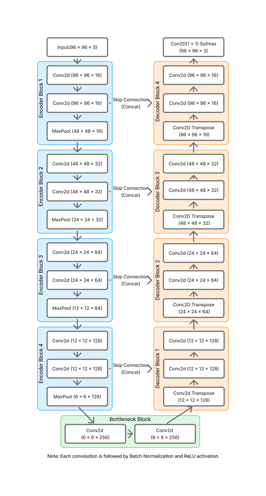
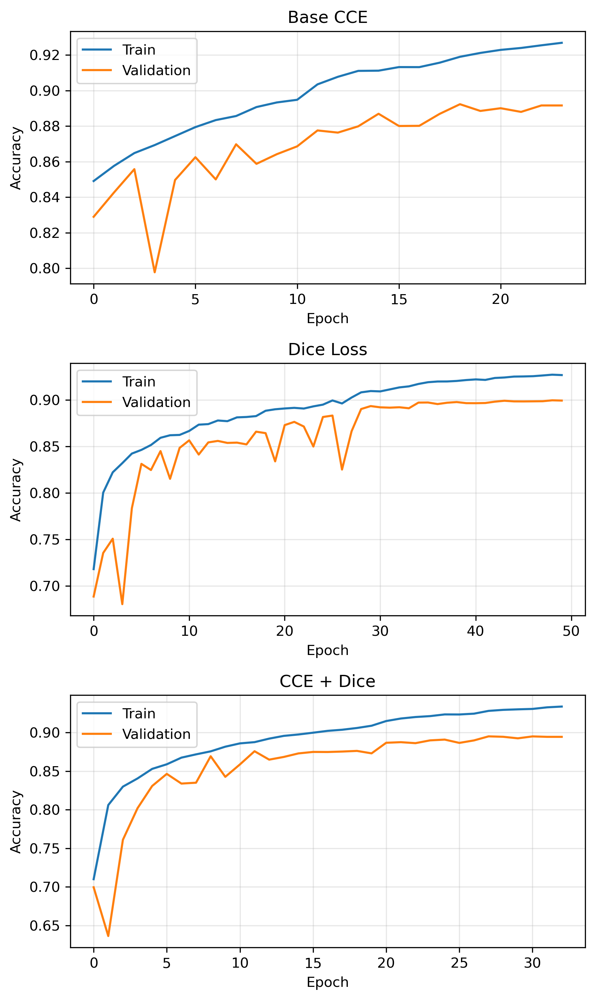
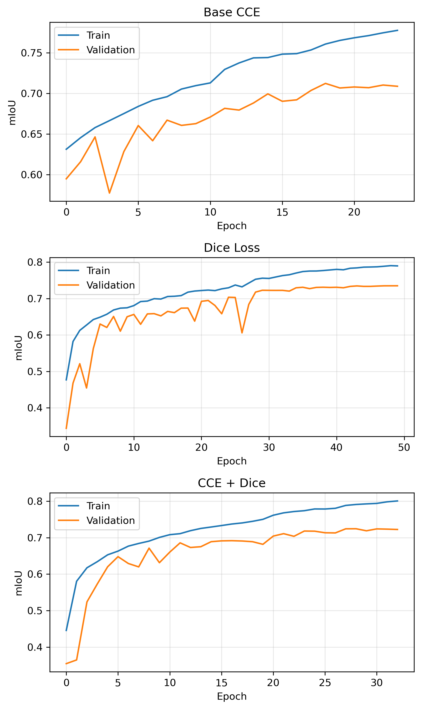
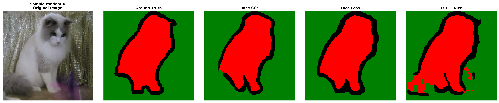

## U-Net Semantic Segmentation on Oxford-IIIT Pet

This project implements a custom U-Net from scratch in TensorFlow/Keras for semantic segmentation on the Oxford-IIIT Pet dataset.

Rather than reproducing the original U-Net architecture, the objective was to understand semantic segmentation by designing encoder and decoder blocks manually, implementing transpose convolutions, skip connections, and building the complete training pipeline from preprocessing to evaluation. The project follows an experiment-driven approach, comparing different loss functions and analyzing both quantitative metrics and qualitative segmentation results.

---

## Features

- Custom U-Net implementation from scratch in TensorFlow/Keras
- Encoder, decoder, and bottleneck blocks
- Skip connections using feature concatenation
- Transpose convolution for learnable upsampling
- Efficient tf.data preprocessing and augmentation pipeline
- Custom Dice Loss implementation
- Custom weighted Dice + Cross Entropy Loss
- Learning rate scheduling, checkpointing, and early stopping
- Mean IoU evaluation
- Prediction visualization and qualitative error analysis
- Modular project structure

---

## Dataset

Dataset: Oxford-IIIT Pet

- 3,680 training images
- 3,669 test images
- RGB images with pixel-wise segmentation masks
- Three segmentation classes:
  - Background
  - Pet
  - Border

---

## Final Architecture

- Input of size (96, 96, 3)
- 4 Encoder Blocks(16 → 32 → 64 → 128)
- each block with 2 Conv2D and a MaxPool layers
- a Bottleneck Block(2 Conv2D layers @256)
- Batch Normalization after every convolution
- 4 Decoder Blocks(128 → 64 → 32 → 16)
- each block with a Conv2DTranspose and 2 Conv2D layers
- skip connections passing information from encoders blocks to corresponding decoder blocks
- a 1x1 Conv2D(@3) with softmax as output layer

Architecture progression:

```
Input (96x96x3)

↓

Encoder Block (16)

↓

Encoder Block (32)

↓

Encoder Block (64)

↓

Encoder Block (128)

↓

Bottleneck Block (256)

↓

Decoder Block (128)

↓

Decoder Block (64)

↓

Decoder Block (32)

↓

Decoder Block (16)

↓

Conv2D (1x1@3, "softmax")

```

<p align="center">

</p>

---

## Final Results

| Model | Train Acc | Train mIoU | Val Acc | Val mIoU | Test Acc | Test mIoU |
|------|----------:|-----------:|---------:|----------:|----------:|-----------:|
| Base U-Net (CCE) | 91.9% | 76.1% | 89.2% | 71.2% | 89.0% | 71.6% |
| U-Net + Dice Loss | 92.7% | 79.0% | **90.0%** | **73.5%** | **89.8%** | **73.9%** |
| U-Net + Dice + CCE | **92.8%** | 78.8% | 89.5% | 72.4% | 89.5% | 73.0% |

---

## Experiments

The project was developed through a series of controlled experiments.

| Experiment | Purpose |
|------------|---------|
| Baseline U-Net | Establish a reference segmentation model using Sparse Categorical Crossentropy |
| Dice Loss | Evaluate whether optimizing region overlap improves segmentation quality |
| Weighted Dice + Cross Entropy | Investigate whether combining pixel-wise and region-wise objectives improves performance |

Each experiment changed only one major component while keeping the architecture, optimizer, preprocessing pipeline, and training configuration unchanged.

---

## Experimental Results

| Experiment | Loss Function | Test mIoU | Observation |
|------------|--------------|----------:|-------------|
| Baseline U-Net | Sparse Categorical Crossentropy | 71.6% | Strong baseline segmentation |
| U-Net + Dice Loss | Custom Dice Loss | **73.9%** | Best quantitative performance, improved boundary prediction |
| U-Net + Dice + CCE | Weighted Dice + Cross Entropy | 73.0% | Better than baseline but did not surpass Dice Loss |

---

# Learning Curves

## Training vs Validation Accuracy

<p align="center">

</p>

## Training vs Validation mean IoU

<p align="center">

</p>

The learning curves illustrate the effect of different loss functions while keeping the network architecture unchanged.

- The baseline Cross Entropy model provided a strong reference, converging to **71.6%** Test Mean IoU.
- Dice Loss accelerated early learning and achieved the best quantitative performance, reaching **73.9%** Test Mean IoU and improving boundary segmentation.
- The weighted Dice + Cross Entropy loss also improved over the baseline (**73.0%** Test Mean IoU), but did not outperform Dice Loss under the selected weighting (Dice = 1.3, CCE = 0.7).

Overall, Dice Loss proved to be the most effective optimization objective for this U-Net implementation, while the combined loss demonstrated that visually balanced predictions do not always correspond to the highest Mean IoU.

---

## Example Predictions

The figure below compares predictions produced by the three trained models.

<p align="center">

</p>

---

## Qualitative Error Analysis

Predictions from all three models were manually compared across multiple randomly selected test images.

Main observations:

- Dice Loss consistently produced the best segmentation boundaries.
- Border pixels were segmented much more accurately than the baseline.
- Thin structures (ears, tails, legs) showed modest improvement with Dice Loss.
- The weighted Dice + Cross Entropy model often produced visually smoother and more balanced masks, although its Mean IoU remained lower than Dice Loss.
- Some challenging examples favored the combined loss, while others favored Dice Loss, indicating that qualitative improvements were not always reflected by Mean IoU alone.
- All models struggled when the pet and background shared similar colors or lighting.
- Fine details remained difficult to recover, likely due to the 96×96 input resolution.

Overall, Dice Loss achieved the highest quantitative performance (73.9% Test mIoU), while the combined loss demonstrated that visually appealing predictions do not necessarily correspond to the highest evaluation metric.

---

unet-pet-segmentation/
│
├── images/
├── models/
├── notebooks/
├── src/
│   ├── blocks.py
│   ├── config.py
│   ├── dataset.py
│   ├── eval.py
│   ├── history.py
│   ├── losses.py
│   ├── model.py
│   ├── train.py
│   └── utils.py
│
├── README.md
├── PROJECT_REPORT.md
└── requirements.txt

---

## Concepts Practiced

- Semantic Segmentation
- U-Net Architecture
- Encoder–Decoder Networks
- Skip Connections
- Transpose Convolutions
- Batch Normalization
- Custom Loss Functions
- Dice Loss
- Weighted Dice + Cross Entropy Loss
- Mean IoU Evaluation
- tf.data Pipelines
- Data Augmentation
- Learning Rate Scheduling
- Model Checkpointing
- Qualitative Error Analysis
- Controlled Experimental Comparison

---

## Future Work

Possible future improvements include:

- Tune Dice and Cross Entropy loss weights
- Increase input resolution (128×128 or 160×160)
- Apply stronger data augmentation
- Evaluate per-class IoU
- Experiment with bilinear upsampling instead of transpose convolution
- Add attention gates (Attention U-Net)
- Compare with pretrained segmentation backbones

---

## Conclusion

This project demonstrated the complete development of a semantic segmentation pipeline using a custom U-Net implemented from scratch.

Three loss functions were evaluated under identical training settings. Dice Loss achieved the highest quantitative performance, improving Test Mean IoU from **71.6%** to **73.9%** over the baseline. A custom weighted Dice + Cross Entropy loss produced competitive results and visually smoother predictions on some examples, but did not surpass Dice Loss under the tested weighting.

Beyond implementing U-Net, the project emphasized an experiment-driven workflow through controlled comparisons, custom loss implementation, quantitative evaluation, and qualitative error analysis.
